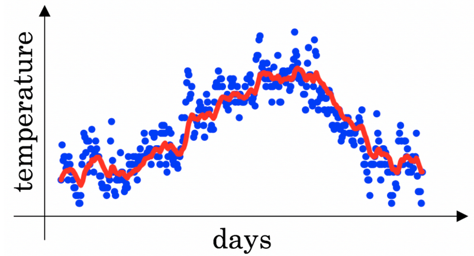

## Optimization algorithms
 

_Correct answers are in **bold**._
 

**Question 1**. Which notation would you use to denote the 3rd layer’s activations when the input is the 7th example from the 8th minibatch?

* a[3]{7}(8)

* a[8]{7}(3)

* **a[3]{8}(7)**

* a[8]{3}(7)

**Question 2**. Which of these statements about mini-batch gradient descent do you agree with?

* You should implement mini-batch gradient descent without an explicit for-loop over different mini-batches, so that the algorithm processes all mini-batches at the same time (vectorization). 

* Training one epoch (one pass through the training set) using mini-batch gradient descent is faster than training one epoch using batch gradient descent.

* **One iteration of mini-batch gradient descent (computing on a single mini-batch) is faster than one iteration of batch gradient descent.**

**Question 3**. Why is the best mini-batch size usually not 1 and not m, but instead something in-between?

* **If the mini-batch size is 1, you lose the benefits of vectorization across examples in the mini-batch.**

* If the mini-batch size is m, you end up with stochastic gradient descent, which is usually slower than mini-batch gradient descent. 

* **If the mini-batch size is m, you end up with batch gradient descent, which has to process the whole training set before making progress.**

* If the mini-batch size is 1, you end up having to process the entire training set before making any progress. 

**Question 4**. Suppose your learning algorithm’s cost J, plotted as a function of the number of iterations, looks like this: 

Which of the following do you agree with?

* **If you’re using mini-batch gradient descent, this looks acceptable. But if you’re using batch gradient descent, something is wrong.**

* Whether you’re using batch gradient descent or mini-batch gradient descent, something is wrong. 

* Whether you’re using batch gradient descent or mini-batch gradient descent, this looks acceptable. 

* If you’re using mini-batch gradient descent, something is wrong. But if you’re using batch gradient descent, this looks acceptable. 

**Question 5**. Suppose the temperature in Casablanca over the first three days of January are the same:

Jan 1st: θ1=10 oC

Jan 2nd: θ210 oC

(We used Fahrenheit in lecture, so will use Celsius here in honor of the metric world.) 

Say you use an exponentially weighted average with β=0.5 to track the temperature: v0=0, vt=βvt−1+(1−β)θt. If v2​ is the value computed after day 2 without bias correction, and v2corrected is the value you compute with bias correction. What are these values? (You might be able to do this without a calculator, but you don't actually need one. Remember what is bias correction doing.)

* v2=10, v2corrected=10

* v2=7.5, v2corrected=7.5

* v2=10, v2corrected=7.5

* **v2=7.5, v2corrected=10**

**Question 6**. Which of these is NOT a good learning rate decay scheme? Here, t is the epoch number. 

* α=1/(1+2∗t) * α0

* **α=e^t * α0**

* α=(1/sqrt(t)) * α0

* α=0.95tα0​

**Question 7**. You use an exponentially weighted average on the London temperature dataset. You use the following to track the temperature: vt=βvt−1+(1−β)θt. The red line below was computed using β=0.9. What would happen to your red curve as you vary β? (Check the two that apply)

* Decreasing β will shift the red line slightly to the right.

* **Increasing β will shift the red line slightly to the right.**

* **Decreasing β will create more oscillation within the red line.**

* Increasing β will create more oscillations within the red line.

**Question 8**. Consider this figure:

These plots were generated with gradient descent; with gradient descent with momentum (β = 0.5) and gradient descent with momentum (β = 0.9). Which curve corresponds to which algorithm? 

* (1) is gradient descent. (2) is gradient descent with momentum (large β) . (3) is gradient descent with momentum (small β)

* (1) is gradient descent with momentum (small β), (2) is gradient descent with momentum (small β), (3) is gradient descent

* **(1) is gradient descent. (2) is gradient descent with momentum (small β). (3) is gradient descent with momentum (large β)**

* (1) is gradient descent with momentum (small β). (2) is gradient descent. (3) is gradient descent with momentum  (large β)

**Question 9**. Suppose batch gradient descent in a deep network is taking excessively long to find a value of the parameters that achieves a small value for the cost function J(W[1],b[1],...,W[L],b[L]). Which of the following techniques could help find parameter values that attain a small value forJ? (Check all that apply) 

* **Try tuning the learning rate α**

* Try initializing all the weights to zero

* **Try better random initialization for the weights**

* **Try using Adam**

* **Try mini-batch gradient descent**

**Question 10**. Which of the following statements about Adam is False?

* The learning rate hyperparameter α\alphaα in Adam usually needs to be tuned.

* We usually use “default” values for the hyperparameters β1,β2​ and ε in Adam (β1=0.9, β2=0.999, ε=10^−8)

* Adam combines the advantages of RMSProp and momentum

* **Adam should be used with batch gradient computations, not with mini-batches.**
